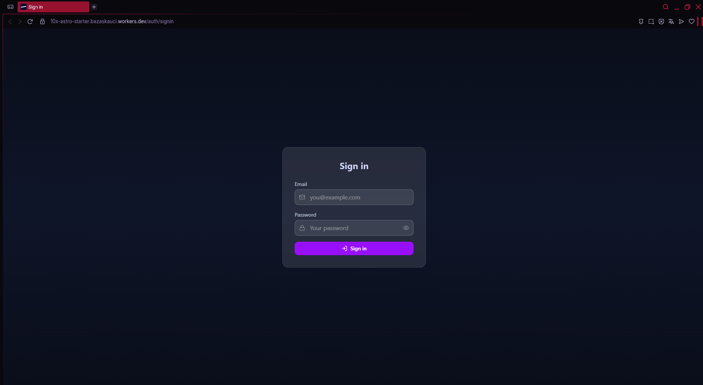
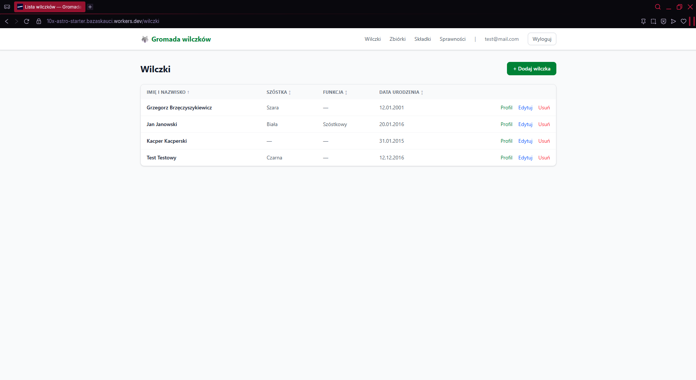
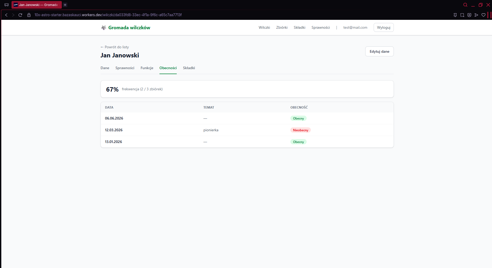
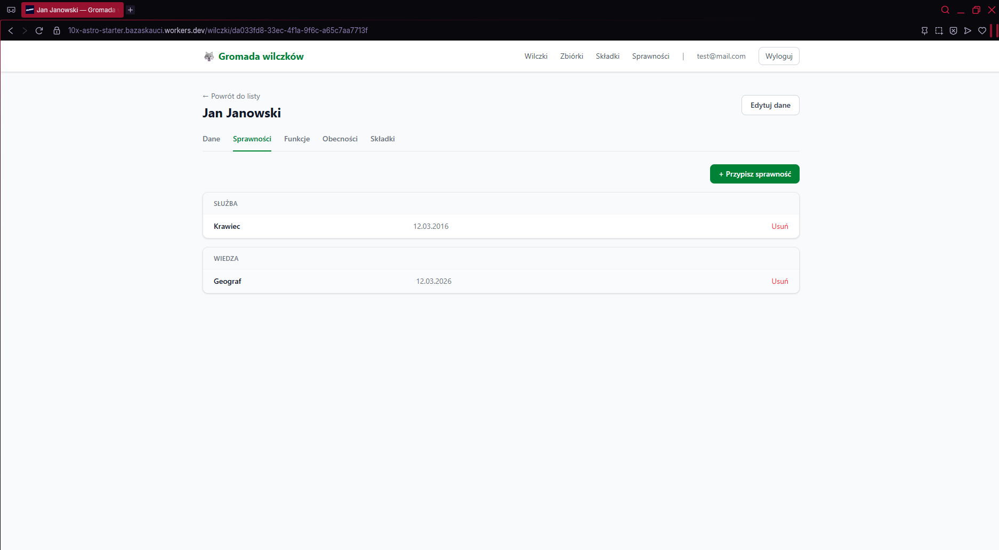
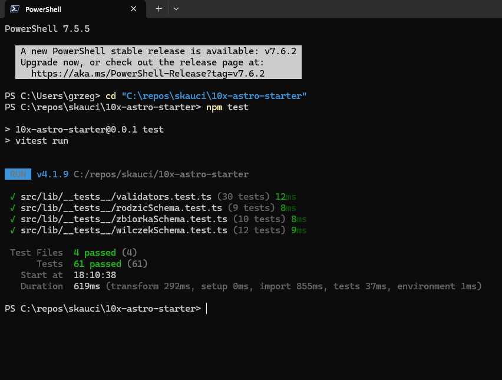

# Sprawozdanie — Aplikacja webowa do zarządzania gromadą wilczków

## 1. Cel projektu

Celem projektu było zaprojektowanie i wdrożenie aplikacji webowej wspomagającej moją pracę jako drużynowego gromady wilczków (polska nazwa dla grupy skautów w wieku 8–12 lat). Aplikacja miała zastąpić papierowe dzienniki i arkusze kalkulacyjne używane do codziennej administracji grupą.

Zdefiniowane wymagania funkcjonalne:

- **Ewidencja członków** — przechowywanie danych osobowych wilczków (imię, nazwisko, data urodzenia, PESEL, adres zamieszkania) oraz danych kontaktowych rodziców i opiekunów
- **Moduł obecności** — rejestrowanie zbiórek i oznaczanie obecności całej grupy jednocześnie, z podglądem historii i procentu frekwencji per wilczek
- **Moduł składek** — śledzenie rocznych wpłat składek członkowskich z informacją o zaległościach
- **Moduł sprawności i funkcji** — słownik sprawności harcerskich z przypisywaniem ich do wilczków (z datą uzyskania), rejestrowanie pełnionych funkcji (szóstkowy, czołowy) oraz przynależność do szóstki (Biała, Szara, Czarna, Brunatna)

Wymagania niefunkcjonalne:

- Dostęp przez przeglądarkę internetową, bez instalacji
- Aplikacja jednoużytkownikowa — tylko ja jako drużynowy mam dostęp
- Bezpieczeństwo danych osobowych (dane wrażliwe: PESEL, adresy dzieci)

---

## 2. Praca z asystentem AI — Claude Code

Całość projektu zrealizowałem przy użyciu **Claude Code** — narzędzia CLI firmy Anthropic, które integruje model językowy bezpośrednio ze środowiskiem programistycznym. Claude Code działa w terminalu i ma dostęp do plików projektu — może je czytać, edytować i uruchamiać polecenia, ale każda operacja modyfikująca pliki wymaga mojego zatwierdzenia.

### Ustalanie planu i wymagań

Pracę zacząłem od opisania problemu w języku naturalnym: czym jest gromada wilczków, jakie dane trzeba przechowywać i jakie operacje wykonywać. Claude Code zareagował serią pytań uszczegóławiających — m.in. czy aplikacja ma obsługiwać wielu użytkowników, czy potrzebne są powiadomienia, czy ma działać offline. Na podstawie moich odpowiedzi wygenerował plik `docs/pytania-wymagania.md` ze streszczeniem wymagań, a następnie `docs/Plan.md` z podziałem na 10 etapów implementacji z opisem zakresu każdego z nich.

Taki podział był kluczowy: zamiast próbować zbudować całą aplikację naraz, każdy etap miał jasno zdefiniowany zakres i kończył się działającym, przetestowalnym przyrostem funkcjonalności.

### Sposób pracy podczas implementacji

Schemat pracy powtarzał się przy każdym etapie:

1. Wydawałem polecenie w stylu „Zrealizuj etap 4 — lista wilczków i CRUD"
2. Claude Code odczytywał dokumentację planu i istniejący kod, a następnie przedstawiał co zamierza zrobić
3. Po moim zatwierdzeniu Claude tworzył i edytował pliki (strony Astro, komponenty React, endpointy API, migracje SQL)
4. Uruchamiałem aplikację lokalnie i weryfikowałem działanie
5. W razie problemów — opisywałem je słownie, Claude diagnozował i poprawiał

W każdym momencie mogłem odrzucić proponowane zmiany, zadać pytanie wyjaśniające lub zmienić kierunek. Przykładowo przy etapie 8 (sprawności) Claude zaproponował pewną strukturę interfejsu, ale po obejrzeniu wyniku poprosiłem o modyfikację — i Claude wprowadził poprawki bez konieczności opisywania ich w kategoriach technicznych.

### Rola pliku CLAUDE.md

Każdorazowe uruchomienie Claude Code zaczyna się od odczytania pliku `CLAUDE.md` znajdującego się w katalogu projektu. Plik ten zawiera:
- opis domeny (terminologia harcerska, struktura aplikacji)
- schemat bazy danych
- konwencje kodowania obowiązujące w projekcie
- opis zrealizowanych funkcjonalności

Dzięki temu Claude Code „pamięta" kontekst projektu między sesjami bez potrzeby powtarzania tych informacji za każdym razem. Aktualizowałem CLAUDE.md po zakończeniu każdego etapu.

---

## 3. Stack technologiczny i konfiguracja środowiska

### Wybór technologii

| Warstwa | Technologia | Uzasadnienie |
|---|---|---|
| Framework | Astro 6 (SSR) | Strony renderowane po stronie serwera — brak ekspozycji danych w przeglądarce |
| Interaktywność | React 19 (wyspy) | Formularze wymagają walidacji po stronie klienta; Astro Islands minimalizuje ilość JS |
| Styling | Tailwind CSS 4 + shadcn/ui | Gotowe komponenty UI klasy produkcyjnej; spójny design bez pisania CSS |
| Baza danych + Auth | Supabase (PostgreSQL) | Wbudowana obsługa uwierzytelniania, Row Level Security, gotowe API |
| Hosting | Cloudflare Workers | Edge deployment — minimalne opóźnienia, bezpłatny tier wystarcza na ruch jednoosobowej aplikacji |
| Język | TypeScript | Bezpieczeństwo typów krytyczne przy danych osobowych |

### Konfiguracja lokalna

Projekt oparłem na szablonie `10x-astro-starter`. Środowisko lokalne wymagało:

1. **Supabase CLI** — uruchamia lokalną instancję bazy PostgreSQL w kontenerach Docker
2. **Cloudflare Wrangler** — lokalny runtime emulujący Workers (komenda `npm run dev` używa `wrangler dev`)
3. Sekrety środowiskowe przechowywane w pliku `.dev.vars` (odpowiednik `.env` dla Workers)

Projekt Supabase w chmurze: `ksdbexbyxjpyaiuwclbs.supabase.co`. Migracje bazy zarządzałem przez Supabase CLI i wersjonowałem w repozytorium (`supabase/migrations/`).

---

## 4. Opis wybranych etapów implementacji

### Etap 2 — Schemat bazy danych

Projekt bazy danych był kluczową decyzją architektoniczną. Zdefiniowałem 8 tabel:

| Tabela | Opis |
|---|---|
| `wilczki` | Dane osobowe członków grupy |
| `rodzice` | Rodzice/opiekunowie powiązani z wilczkiem |
| `sprawnosci` | Słownik sprawności harcerskich |
| `wilczek_sprawnosci` | Relacja wiele-do-wielu: sprawność uzyskana przez wilczka z datą |
| `funkcje` | Funkcje pełnione w grupie z datami obowiązywania |
| `zbiorki` | Spotkania grupy (data, temat, miejsce) |
| `obecnosci` | Obecność wilczka na konkretnej zbiórce |
| `skladki` | Roczne składki członkowskie |

Kluczowe decyzje projektowe:

- **Row Level Security (RLS)** włączone na wszystkich tabelach — nawet przy ewentualnym wycieku klucza API, dane są dostępne wyłącznie dla zalogowanego użytkownika
- **`ON DELETE CASCADE`** na kluczach obcych — usunięcie wilczka automatycznie usuwa wszystkie powiązane rekordy (rodzice, sprawności, obecności, składki), co eliminuje osierocone dane
- Ograniczenia `UNIQUE` zapobiegające duplikatom (np. jeden rekord składki per wilczek per rok)

### Etap 3 — Uproszczenie uwierzytelniania

Supabase domyślnie oferuje pełny system rejestracji i logowania. Ponieważ aplikacja jest jednoużytkownikowa, wyłączyłem rejestrację nowych kont na poziomie aplikacji — endpoint `/api/auth/signup` zwraca błąd 403. Swoje konto założyłem ręcznie przez panel Supabase.

Napisałem middleware (`src/middleware.ts`), który wykonuje się na każdym żądaniu: tworzy klienta Supabase z ciasteczkami sesji, weryfikuje tożsamość użytkownika i przekierowuje nieuwierzytelnionych na stronę logowania. Mechanizm ten zabezpiecza całą aplikację jednym punktem kontroli dostępu.

### Etap 4 — Lista wilczków i CRUD

Pierwszym widokiem po zalogowaniu jest lista wszystkich wilczków z możliwością dodawania, edytowania i usuwania rekordów. Na liście widoczne są podstawowe dane każdego wilczka, jego szóstka oraz aktualna funkcja w grupie.

### Etap 6 — Moduł oznaczania obecności

Moduł obecności był technicznie najbardziej złożonym elementem. Główne wyzwanie: jak efektywnie oznaczyć obecność kilkunastu wilczków na jednej zbiórce bez wysyłania osobnego żądania HTTP dla każdego wpisu.

Zastosowałem **bulk upsert** — jeden endpoint `POST /api/zbiorki/[id]/obecnosci` przyjmuje tablicę wszystkich wilczków z flagą `obecny: boolean` i wykonuje operację `upsert` w Supabase. Dzięki klauzuli `ON CONFLICT DO UPDATE` jeden request obsługuje zarówno nowe wpisy, jak i aktualizację istniejących.

Zbudowany przeze mnie interfejs strony `/zbiorki/[id]/obecnosci` (komponent `ObecnosciForm.tsx`):
- Lista wszystkich wilczków z checkboxami
- Przyciski „Zaznacz wszystkich" / „Odznacz wszystkich"
- Licznik obecnych aktualizowany na bieżąco
- Jeden przycisk zapisu wysyłający stan wszystkich checkboxów naraz

W profilu wilczka zakładka **Obecności** prezentuje historię zbiórek z informacją czy wilczek był obecny oraz obliczony procentowy wskaźnik frekwencji.

### Etap 8 — Moduł sprawności

Zaimplementowałem słownik 29 wbudowanych sprawności harcerskich podzielonych na kategorie (Służba, Zręczność, Wiara, Wiedza, Zmysł praktyczny) z możliwością dodawania własnych. W profilu każdego wilczka zakładka **Sprawności** pokazuje listę zdobytych odznak z datami uzyskania.

### Etap 9 — Testy jednostkowe

Do projektu dodałem testy jednostkowe przy użyciu **Vitest** — runnera testów kompatybilnego z Vite (którego używa Astro), co pozwoliło uniknąć dodatkowej konfiguracji bundlera.

Testowaniu poddałem logikę niezależną od bazy danych ani frameworka:

**Walidatory** (`src/lib/validators.ts`) — funkcje walidujące dane wejściowe formularzy:
- `isValidPesel` — algorytm sumy kontrolnej PESEL (11-cyfrowy numer z weryfikacją cyfry kontrolnej)
- `isValidKodPocztowy` — format `XX-XXX`
- `isValidDataUrodzenia` — format `DD.MM.RRRR` z weryfikacją realności daty (np. odrzucenie 31 lutego)
- `isValidTelefon` — 9 cyfr, opcjonalnie z prefiksem `+48`, toleruje spacje i myślniki

**Schematy Zod** — walidacja danych wejściowych API:
- `wilczekSchema` — w tym sprawdzenie wszystkich wartości enum szóstki (Biała, Szara, Czarna, Brunatna)
- `rodzicBodySchema` / `rodzicUpdateSchema` — walidacja UUID, wymaganych pól
- `zbiorkaSchema` / `obecnosciSchema` — walidacja struktury danych zbiórki i obecności

Łączny wynik: **61 testów w 4 plikach**, wszystkie przechodzą.

---

## 5. Wyniki

Wdrożyłem aplikację na Cloudflare Workers. Działa produkcyjnie pod adresem:

**https://10x-astro-starter.bazaskauci.workers.dev**

Zrealizowane funkcjonalności:
- Pełny CRUD wilczków z walidacją danych osobowych (PESEL, data urodzenia, kod pocztowy, telefon)
- Zarządzanie rodzicami/opiekunami z ograniczeniem biznesowym (max 1 matka + 1 ojciec per wilczek)
- Moduł zbiórek i oznaczania obecności (bulk upsert, frekwencja procentowa)
- Moduł składek rocznych z widokiem zaległości
- Słownik sprawności (29 wbudowanych + CRUD) z przypisywaniem do wilczków
- Rejestrowanie funkcji w grupie i przynależności do szóstki
- 61 testów jednostkowych pokrywających logikę walidacji
